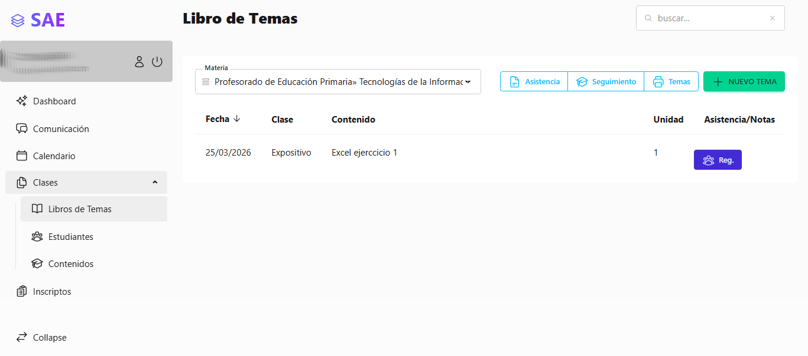
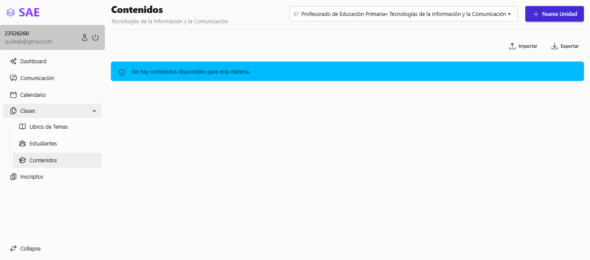
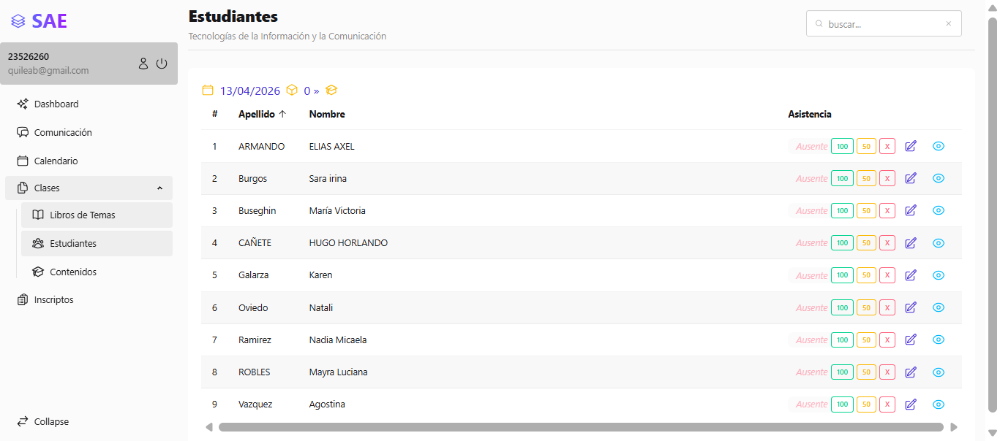
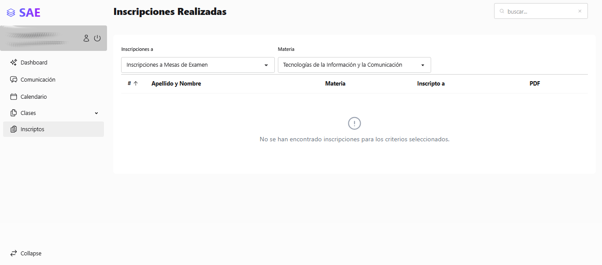
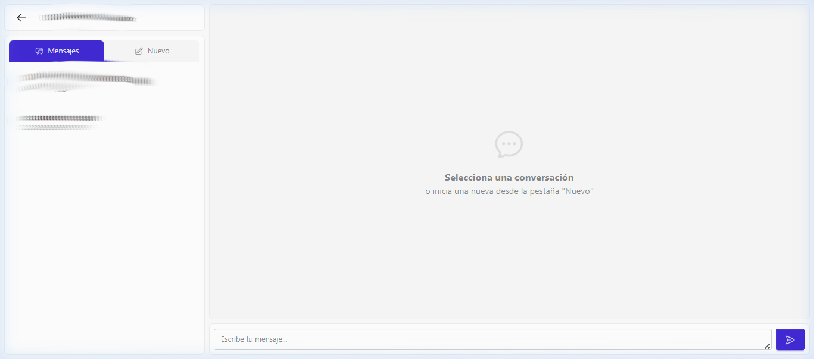

# Manual de Usuario - Perfil Profesor

Bienvenido al **Sistema de Administración Escolar (SAE)**. Este manual está diseñado para guiarte a través de las herramientas principales que tienes disponibles como Profesor en la plataforma. Desde aquí podrás gestionar tus clases, registrar la asistencia de los alumnos, organizar los contenidos de tus materias y mantener comunicación fluida con la comunidad educativa.

---

## 1. Panel Principal (Dashboard)
Al iniciar sesión con tu cuenta, la primera pantalla que verás es el **Panel Principal** o Dashboard. Éste te ofrece un resumen visual rápido sobre tu actividad:

*   **Ciclo Lectivo:** En la parte superior podrás verificar y cambiar el año lectivo en el que estás trabajando (ej. 2026).
*   **Mis Materias:** Un bloque central desde el cual puedes acceder velozmente a los recursos de las materias que dictas. Aquí verás opciones como **VER LIBRO** y **CONTENIDO** para cada una de tus asignaturas asignadas.
*   **Tarjetas de Resumen:** Visualizarás distintos indicadores (como mesas de examen próximas), que te mantienen al tanto de las actividades inminentes.

---

## 2. Gestión de Clases
El menú lateral principal de la plataforma cuenta con la sección **Clases**, la cual es la herramienta principal en tu gestión diaria y está subdividida de la siguiente manera:

### A. Libro de Temas
Aquí es donde registras el avance pedagógico de tus materias.

*   **Visualizar Temas:** Una tabla completa te mostrará la fecha, materia, nombre del módulo cursado y el tipo de libro de todas las sesiones registradas previamente.
*   **Nuevo Tema:** Al presionar el botón **"NUEVO TEMA"**, podrás agregar el registro de una nueva clase. Se te pedirá completar la Fecha, Número de Clase correlativo, Unidad (o ingresar 0 si no corresponde a ninguna), Modalidad (Virtual o Presencial) y detallar los temas dictados y actividades dadas.

### B. Contenidos de la Materia
Esta sección te permite definir y administrar el programa académico (Syllabus) de tu materia.

*   **Organización:** Podrás observar la lista de unidades con su respectivo orden.
*   **Agregar Unidades:** Utiliza el botón de **"NUEVA UNIDAD"** para estructurar la currícula. Cuentas con un editor de texto enriquecido que te facilitará dejar consignas o descripciones globales y detalladas del programa.

### C. Estudiantes (Asistencia y Notas)
La interfaz principal para mantener al día la participación de los alumnos por cada sesión dictada.

*   **Tomar Asistencia:** Al seleccionar la materia y fecha de la sesión correspondiente, se listarán los estudiantes. Encontrarás botones rápidos de asistencia para cada uno:
    *   **100**: Presente.
    *   **50**: Llegada Tarde / Presencia Parcial.
    *   **X**: Ausente.
*   **Acreditación:** Desde aquí mismo puedes registrar si un alumno completó las actividades correspondientes a dicha sesión.

---

## 3. Listado de Inscriptos
Te permite visualizar la nómina completa de los estudiantes inscriptos formalmente en cualquiera de tus asignaturas correspondientes.

*   **Información Detallada:** Podrás consultar instantáneamente el nombre, condición regular de cursada y fecha de inscripción de cada alumno.
*   **Consultas:** Utilizando el ícono del "Ojo" (Ver), accederás a una vista pormenorizada del historial académico del estudiante dentro de tu materia.

---

## 4. Comunicación (Chat)
La plataforma incluye un sistema de mensajería interna ágil para resolver consultas con autoridades directivas, personal administrativo o estudiantes.

*   **Mensajes:** En esta pestaña verás tu historial de todas las conversaciones activas.
*   **Nuevo:** Puedes buscar e iniciar una nueva conversación en tiempo real con otro miembro de la institución.

> **Tip:** Recuerda que cualquier modificación que realices sobre la asistencia y libro de clases es fundamental para el seguimiento académico de los estudiantes y el correcto cumplimiento de las normativas de la institución. En caso de dudas con algún procedimiento, puedes utilizar la sección de Comunicación para consultar directamente con secretaría o preceptoría.
