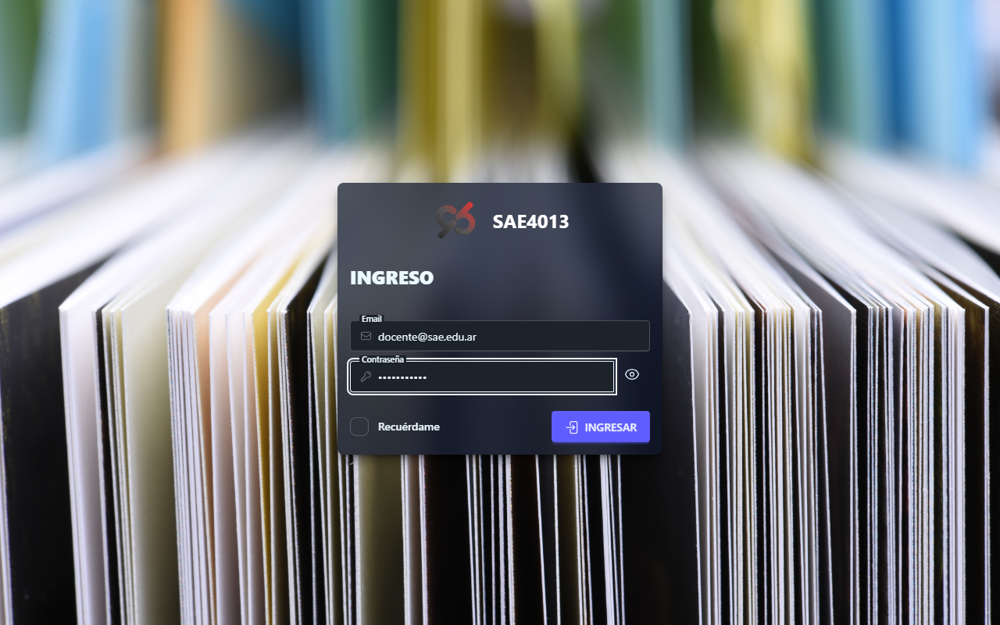
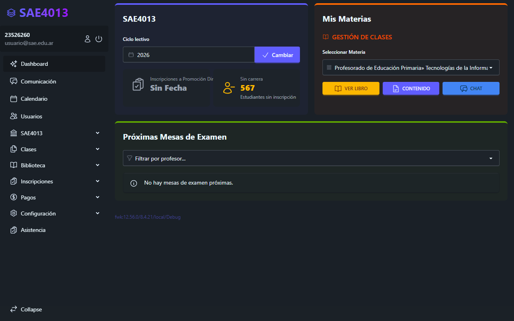
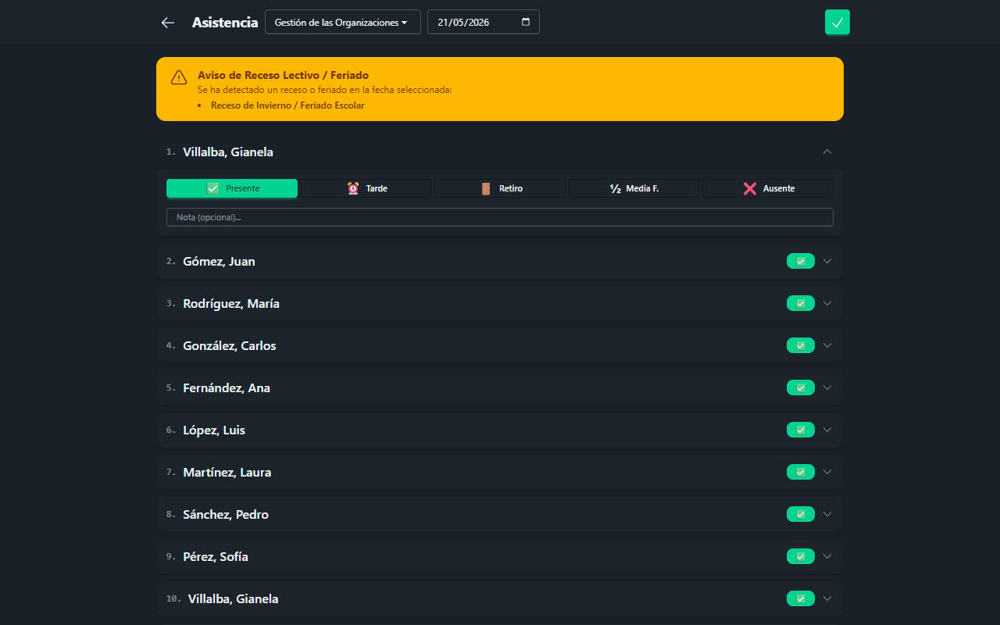
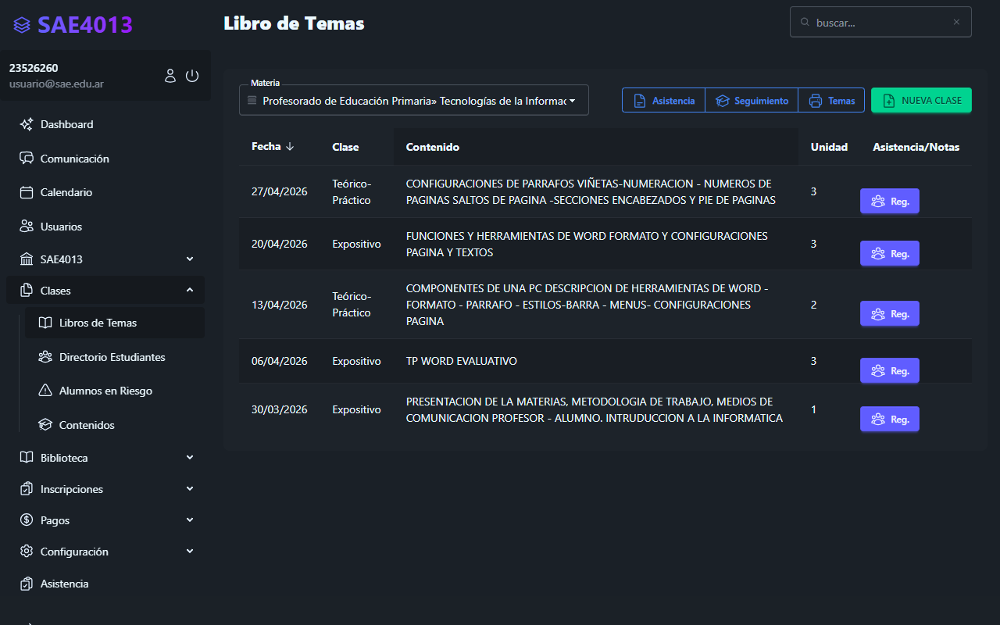
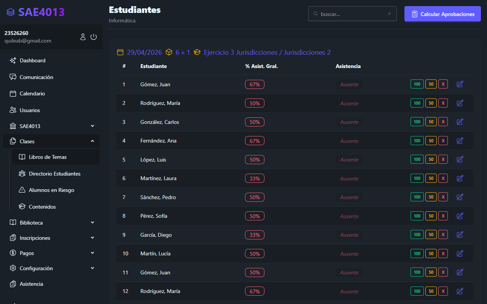
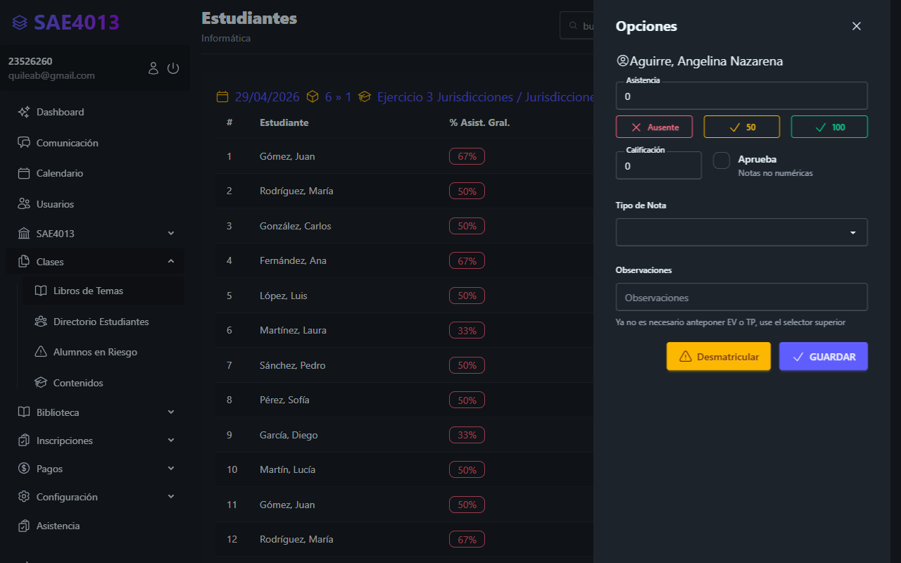
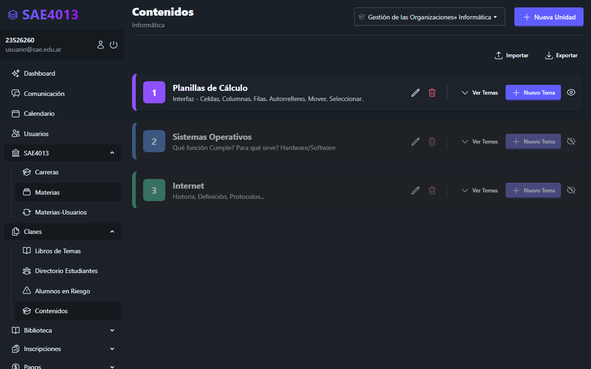
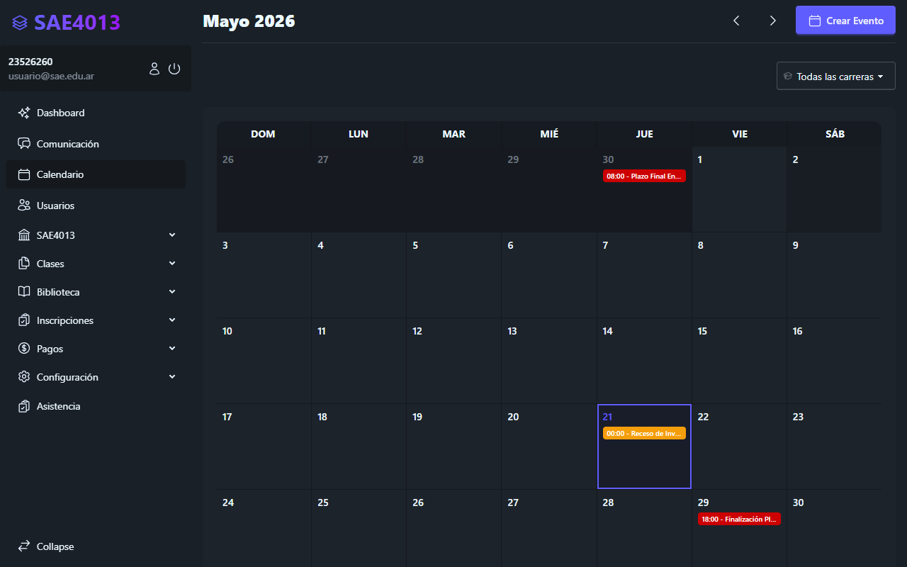
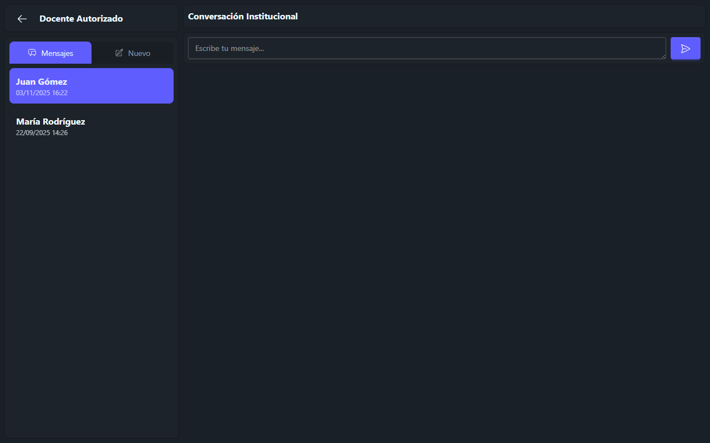

# Manual de Usuario para Docentes
## Sistema de Administración Escolar (SAE)

Este manual ha sido diseñado para guiar a los docentes en el uso y aprovechamiento de todas las herramientas provistas por el **Sistema de Administración Escolar (SAE)**. A través de este sistema, podrá gestionar la asistencia diaria de sus estudiantes, realizar el seguimiento de clases presenciales y virtuales, cargar calificaciones, subir recursos educativos y mantener una comunicación fluida con la comunidad escolar.

---

## Indice de Contenidos
1. [Acceso al Sistema](#1-acceso-al-sistema)
2. [Panel de Inicio (Dashboard)](#2-panel-de-inicio-dashboard)
3. [Registro de Asistencia General](#3-registro-de-asistencia-general)
   - 3.1 [Indicador de Certificados Médicos o Licencias](#31-indicador-de-certificados-médicos-o-licencias)
   - 3.2 [Alerta de Receso Lectivo o Feriado](#32-alerta-de-receso-lectivo-o-feriado)
4. [Gestión de Clases y Sesiones](#4-gestión-de-clases-y-sesiones)
   - 4.1 [Listado de Sesiones de Clase](#41-listado-de-sesiones-de-clase)
   - 4.2 [Registro de Asistencia de Sesión](#42-registro-de-asistencia-de-sesión)
   - 4.3 [Calificaciones y Observaciones del Estudiante](#43-calificaciones-y-observaciones-del-estudiante)
5. [Biblioteca y Recursos Didácticos (Contenidos)](#5-biblioteca-y-recursos-didácticos-contenidos)
6. [Calendario de Eventos y Horarios](#6-calendario-de-eventos-y-horarios)
7. [Módulo de Mensajería (Chat Interno)](#7-módulo-de-mensajería-chat-interno)

---

## 1. Acceso al Sistema

Para ingresar al entorno del docente en el sistema SAE, siga estos sencillos pasos:

1. Abra su navegador web habitual y navegue hacia la dirección provista por la institución (ej. `sae.test`).
2. En la pantalla de inicio de sesión, introduzca sus credenciales:
   - **Correo Electrónico**: Su dirección de correo registrada en la institución.
   - **Contraseña**: Su contraseña personal de acceso seguro.
3. Presione el botón **Ingresar**.

> [!NOTE]
> Por motivos de seguridad, recuerde no compartir su contraseña con terceros y cerrar su sesión al finalizar su trabajo en equipos compartidos.

---

## 2. Panel de Inicio (Dashboard)

Una vez que acceda al sistema, será recibido por el **Dashboard del Docente**. Este panel principal proporciona una visión consolidada y rápida de las actividades académicas.

Desde aquí podrá visualizar:
- **Resumen Estadístico**: Indicadores clave sobre sus cursos y estudiantes.
- **Accesos Rápidos**: Botones interactivos que le permiten saltar directamente a la carga de asistencia, la creación de sesiones de clases, la biblioteca o la mensajería.
- **Widget de Próximos Exámenes**: Una sección dedicada a recordarle las evaluaciones y exámenes agendados a corto plazo para que pueda prepararse con antelación.

---

## 3. Registro de Asistencia General

El sistema cuenta con un módulo de **Asistencia Diaria** diseñado con interfaz responsiva (estilo PWA), lo que facilita su uso tanto desde computadoras de escritorio como desde teléfonos móviles o tablets directamente en el aula.

Para registrar o consultar la asistencia general de una carrera o curso:
1. Ingrese a la sección **Asistencia** desde el menú lateral o el Dashboard.
2. Seleccione la **Carrera / Materia** que desea consultar.
3. Especifique la **Fecha** correspondiente.
4. El sistema cargará el listado completo de estudiantes inscritos. Puede marcar el estado de asistencia haciendo clic sobre las opciones correspondientes (Presente, Ausente, Tarde o Justificado).

### 3.1 Indicador de Certificados Médicos o Licencias
Para facilitarle la labor de control de inasistencias, el sistema cruza información en tiempo real con el registro de licencias del alumnado:
* Si un estudiante cuenta con una justificación activa para la fecha seleccionada (por ejemplo, un certificado médico, una licencia por viaje de representación institucional o un trámite administrativo), se mostrará un **icono de color azul informativo** junto a su nombre.
* Al pasar el cursor (o pulsar sobre él en dispositivos táctiles), aparecerá un recuadro emergente (tooltip) con el detalle registrado para que usted pueda decidir el cómputo final de la falta.

### 3.2 Alerta de Receso Lectivo o Feriado
Si la fecha seleccionada para la asistencia coincide con un período de vacaciones, receso invernal, jornada institucional o feriado oficial cargado en el calendario académico:
* Se desplegará un **banner de advertencia amarillo** en la parte superior informando del receso correspondiente.
* El sistema le permitirá realizar la carga de asistencia de igual manera si es requerido por razones especiales, pero le alertará para prevenir registros accidentales en días inhábiles.

---

## 4. Gestión de Clases y Sesiones

El núcleo de su actividad diaria se gestiona a través de la sección **Mis Clases**, donde podrá llevar la planificación y el seguimiento por menorizado de cada encuentro presencial o virtual.

### 4.1 Listado de Sesiones de Clase
Al acceder a sus materias, verá el listado de las **Sesiones de Clase** planificadas. Cada sesión contiene la fecha, el horario de dictado, el aula física asignada y una descripción general de los temas a tratar o la planificación del día.

### 4.2 Registro de Asistencia de Sesión
Al seleccionar una sesión de clase específica, podrá realizar la carga de asistencia correspondiente a ese bloque horario. Esto asegura que la asistencia se vincule al contenido dictado en esa fecha específica y que los alumnos cuenten con un historial detallado de su presencialidad.

### 4.3 Calificaciones y Observaciones del Estudiante
Cuando se encuentra cargando la asistencia o las notas de una sesión de clase, puede ver un desglose detallado de cada alumno de forma individual:
* Haga clic sobre el nombre del estudiante para abrir el **Drawer Lateral de Detalle**.
* En este panel podrá cargar de forma rápida **calificaciones numéricas o conceptuales** obtenidas en las actividades del día.
* Además, dispone de un campo de **Observaciones** para registrar notas sobre la conducta del alumno, dificultades de aprendizaje detectadas o felicitaciones por su desempeño académico en clase.

---

## 5. Biblioteca y Recursos Didácticos (Contenidos)

El SAE cuenta con un **Administrador de Contenidos** para que los docentes publiquen el material didáctico que sus alumnos necesitan para el cursado de la materia.

Desde este módulo usted podrá:
- Crear unidades temáticas o temas organizadores.
- Subir archivos y documentos digitales (PDF, Word, imágenes, etc.).
- Compartir enlaces a sitios web de interés, videos de YouTube o carpetas en la nube.
- Escribir instrucciones directas y descripciones para orientar el estudio independiente de los estudiantes.

> [!TIP]
> Organizar sus recursos en carpetas o temas secuenciales ayuda significativamente a los estudiantes a encontrar la información relevante y reduce las consultas administrativas.

---

## 6. Calendario de Eventos y Horarios

La herramienta de **Calendario** unifica toda la planificación temporal del año académico. Los docentes tienen acceso a una cuadrícula interactiva mensual donde pueden ver y programar eventos.

Funcionalidades principales del calendario:
- **Visualización General**: Permite observar feriados, recesos escolares y eventos institucionales programados.
- **Creación de Eventos**: Haga clic sobre cualquier día para agendar actividades especiales, entregas de trabajos prácticos o clases de consulta.
- **Agendar Exámenes**: Al crear un evento de tipo "Examen", este aparecerá automáticamente en el Dashboard de sus estudiantes, ayudándoles a organizar su tiempo de estudio.

---

## 7. Módulo de Mensajería (Chat Interno)

Para asegurar una comunicación ágil sin necesidad de compartir datos personales como números telefónicos privados, el sistema dispone de un **Chat Interno** institucional.

El panel de chat se organiza de la siguiente manera:
* **Pestaña de Mensajes (💬)**: Muestra todas las conversaciones activas. Los estudiantes y el personal administrativo están claramente etiquetados con emojis representativos de sus roles:
  - 👨‍🎓 Estudiante
  - 🧑‍🏫 Profesor
  - 👑 Administrador
  - 📚 Curso / Materia (Chat grupal de la clase)
* **Pestaña "Nuevo" (✏️)**: Permite iniciar una conversación privada con directivos, preceptores, otros docentes o administradores.
* **Chats Grupales de Curso**: Cada materia asignada cuenta con un canal de chat compartido con todos los estudiantes matriculados. Desde allí podrá enviar comunicados rápidos, responder dudas frecuentes y fomentar la participación.

> [!IMPORTANT]
> Los estudiantes tienen restringida la mensajería directa entre sí por razones de convivencia y enfoque pedagógico, pero pueden participar activamente dentro del canal grupal de su materia bajo la moderación de usted como docente a cargo.

---

## Soporte y Ayuda

Si experimenta algún inconveniente técnico, detecta inconsistencias en los listados de alumnos o requiere asistencia adicional para el uso de la plataforma, por favor póngase en contacto con el departamento de soporte técnico escolar o con la secretaría de la institución.
