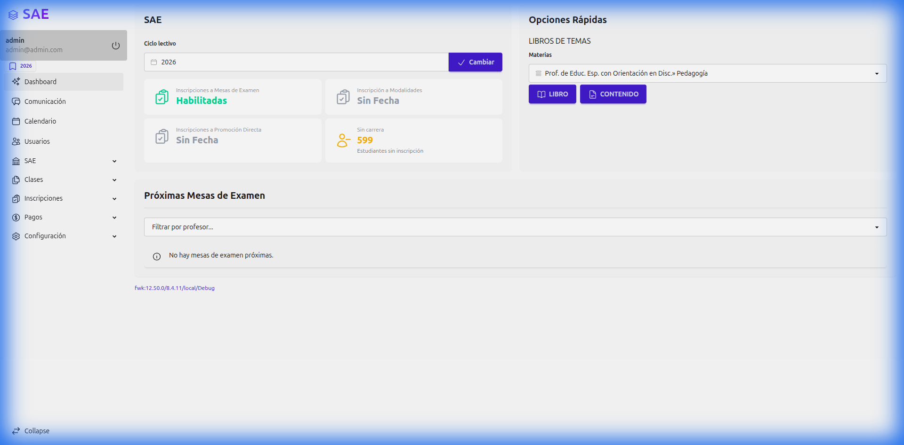
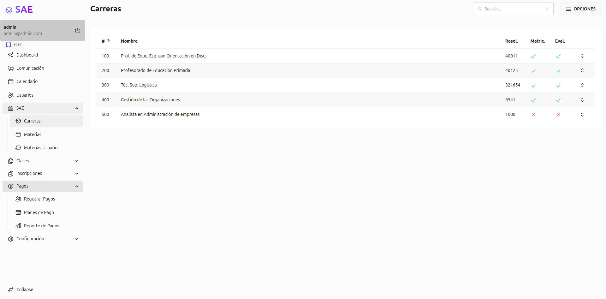
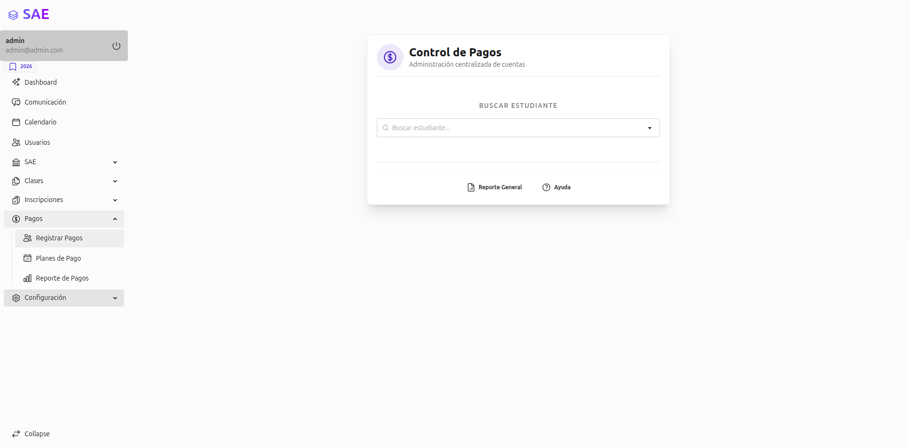
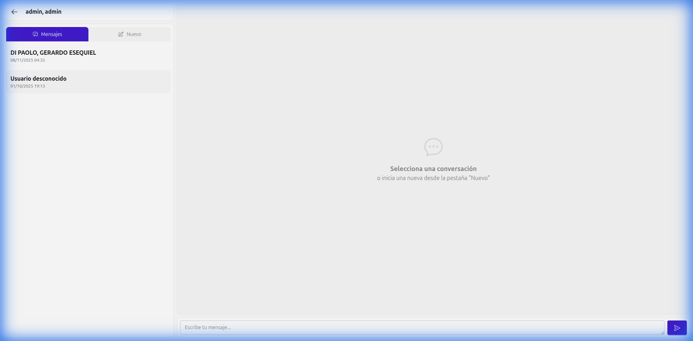

# Manual de Usuario - Sistema de Administración Escolar (SAE)

## 1. Introducción
Bienvenido al Sistema de Administración Escolar (SAE). Este sistema es una plataforma integral diseñada para facilitar la gestión académica y administrativa de la institución. Permite la interacción fluida entre administradores, profesores y estudiantes, centralizando la información y optimizando los procesos educativos.

## 2. Acceso al Sistema
Para ingresar al sistema, siga estos pasos:
1.  Abra su navegador web y diríjase a la dirección del sistema.
2.  En la pantalla de inicio de sesión (`/login`), ingrese sus credenciales:
    *   **Correo Electrónico**: Su dirección de email registrada.
    *   **Contraseña**: Su clave de acceso personal.
3.  Haga clic en el botón **"Ingresar"**.
    *   *Nota: Si olvidó su contraseña, contacte al administrador para restablecerla.*

---

## 3. Rol: Administrador
El perfil de Administrador tiene el nivel de acceso más alto y es responsable de la gestión global del sistema.

### 3.1 Gestión de Usuarios
*Ubicación: Menú Principal > Usuarios*
*   **Listado de Usuarios**: Visualice todos los usuarios registrados en el sistema con sus roles y estados.
*   **Crear Usuario**: Registre nuevos usuarios asignando roles específicos (Administrador, Profesor, Estudiante, Director, Administrativo, Tesorero).
*   **Editar Usuario**: Modifique datos personales o roles de usuarios existentes.
*   **Importar Usuarios**: Utilice la herramienta de importación masiva para cargar múltiples usuarios desde un archivo externo.

### 3.2 Gestión Académica
*Ubicación: Menú Principal > Académico*
*   **Carreras**: Cree y administre las carreras o programas educativos que ofrece la institución.
*   **Materias**: Configure el catálogo de materias, asignándolas a las carreras correspondientes.
*   **Inscripciones**:
    *   Gestione las inscripciones de los alumnos a las materias.
    *   Genere reportes PDF de las inscripciones.
    *   Visualice listas de inscritos por materia.

### 3.3 Gestión de Clases
*Ubicación: Menú Principal > Clases*
*   **Sesiones de Clase**: Supervise las sesiones de clase programadas por los profesores.
*   **Asistencia**: Monitoree los registros de asistencia de los alumnos.
*   **Reportes**: Acceda a reportes de asistencia y calificaciones.

### 3.4 Gestión Financiera
*Ubicación: Menú Principal > Finanzas*
*   **Planes de Pago**: Configure los diferentes planes de pago y cuotas aplicables a los estudiantes.
*   **Pagos de Usuarios**: Registre pagos manuales y verifique el estado de cuenta de cada estudiante.
*   **Reportes de Pagos**: Genere informes detallados sobre los ingresos y pagos pendientes.

### 3.5 Configuraciones del Sistema
*Ubicación: Menú Principal > Configuración*
*   Ajuste parámetros globales del sistema según las necesidades de la institución.

---

## 4. Rol: Profesor
El perfil de Profesor está enfocado en la gestión del aula y el seguimiento académico de los estudiantes.

### 4.1 Gestión de Clases
*Ubicación: Menú Principal > Mis Clases*
*   **Sesiones**: Cree y planifique las sesiones de sus clases.
*   **Toma de Asistencia**: Registre la asistencia de los alumnos en cada sesión.
*   **Listas de Alumnos**: Acceda al listado actualizado de estudiantes inscritos en sus materias.

### 4.2 Gestión de Contenidos
*Ubicación: Menú Principal > Contenidos*
*   **Administrador de Contenido**: Suba material didáctico (documentos, enlaces, videos) para sus alumnos.
*   **Organización**: Estructure el contenido por temas o unidades para facilitar el acceso a los estudiantes.

### 4.3 Calendario y Eventos
*Ubicación: Menú Principal > Calendario*
*   **Vista Mensual**: Visualice su horario de clases, fechas de exámenes y eventos académicos.
*   **Gestión de Eventos**: Cree nuevos eventos (exámenes, entregas, avisos), agregue descripciones y asigne profesores responsables si es necesario.
*   **Widget de Próximos Exámenes**: En el Dashboard principal, verá un resumen rápido de las evaluaciones cercanas.

### 4.4 Reportes
*   Genere reportes de calificaciones y asistencia de sus grupos para el seguimiento académico, ahora con un diseño optimizado para impresión y visualización clara.

---

## 5. Rol: Estudiante
El perfil de Estudiante permite gestionar la vida académica y administrativa dentro de la institución.

### 5.1 Área Académica
*   **Inscripciones**: Realice su inscripción a las materias habilitadas para su carrera en el periodo correspondiente.
*   **Mis Materias**: Acceda al "Contenido Simplificado" de sus materias para ver y descargar el material de estudio proporcionado por los profesores.
*   **Calendario y Exámenes**: Consulte su horario de clases y fechas de entrega. Utilice el widget "Próximos Exámenes" en el inicio para estar al tanto de sus evaluaciones inminentes.

### 5.2 Área Administrativa / Financiera
*   **Mi Plan de Pagos**: Consulte el plan de pagos asignado, fechas de vencimiento y montos.
*   **Detalle de Pagos**: Vea el historial de sus pagos realizados y el estado actual de su cuenta (al día o con deuda).
*   **Recibos**: Descargue comprobantes de sus pagos si el sistema lo permite.

---

## 6. Sistema de Mensajería (Chat)
El sistema cuenta con un módulo de comunicación interna robusto y mejorado para facilitar la interacción entre todos los miembros de la comunidad educativa.

*Ubicación: Ícono de Chat en la barra superior o navegación móvil.*

### 6.1 Organización del Panel
El panel de mensajería se divide en dos pestañas principales para una navegación intuitiva:
*   **Pestaña "Mensajes" (Icono 💬)**: Muestra su historial de conversaciones.
    *   **Identificación de Roles**: Los usuarios se identifican visualmente con emojis:
        *   👨‍🎓 Estudiante
        *   🧑‍🏫 Profesor
        *   👑 Administrador
        *   👔 Director
        *   📚 Curso (Materia)
    *   **Contexto de Curso**: Las conversaciones grupales de materias muestran claramente el nombre del curso y la carrera a la que pertenecen (ej. "Matemáticas - Ingeniería").
    *   **Notificaciones**: Un distintivo rojo (🔴) indica la cantidad de mensajes no leídos en cada conversación.
*   **Pestaña "Nuevo" (Icono ✏️)**: Permite iniciar nuevas conversaciones.

### 6.2 Funcionalidades de Chat
*   **Envío de Mensajes**:
    *   Puede enviar mensajes directos a **Usuarios** (profesores, administradores, etc.).
    *   Puede enviar mensajes grupales a **Cursos** completos (si está matriculado o es el profesor).
    *   *Nota: Los estudiantes no pueden enviar mensajes privados a otros estudiantes, pero pueden participar en los chats de sus cursos.*
*   **Enlaces Inteligentes**: Si comparte una dirección web (URL), el sistema la convertirá automáticamente en un enlace clicable que se abre en una nueva pestaña.
*   **Historial Infinito**: Cargue mensajes antiguos simplemente desplazándose hacia arriba en la conversación (Scroll Infinito).
*   **Lectura de Mensajes**: Al entrar en una conversación, los mensajes se marcan automáticamente como leídos y el contador de notificaciones se actualiza.

---

## Soporte
Si encuentra problemas técnicos o tiene dudas sobre el uso del sistema que no estén cubiertas en este manual, por favor contacte al departamento de soporte técnico o a la administración de la institución.